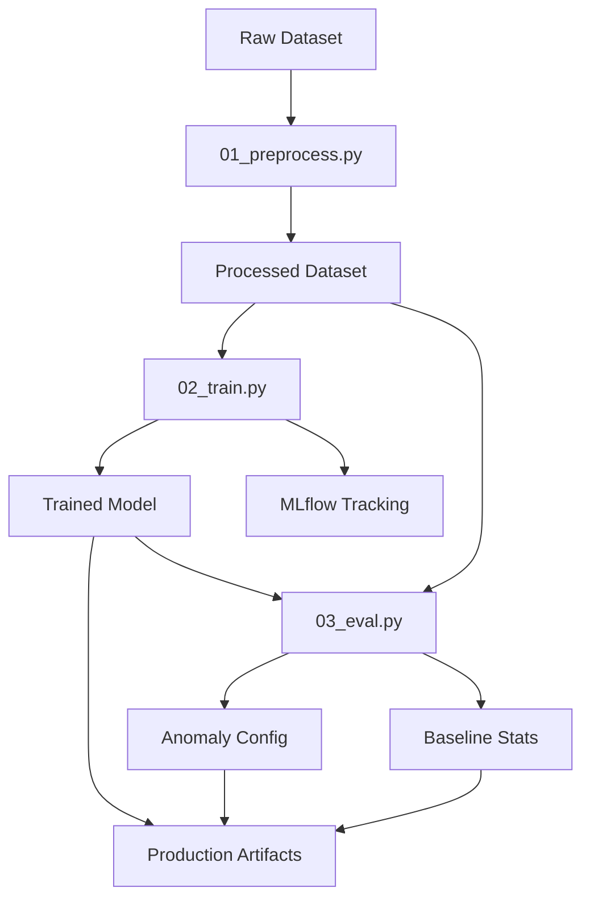
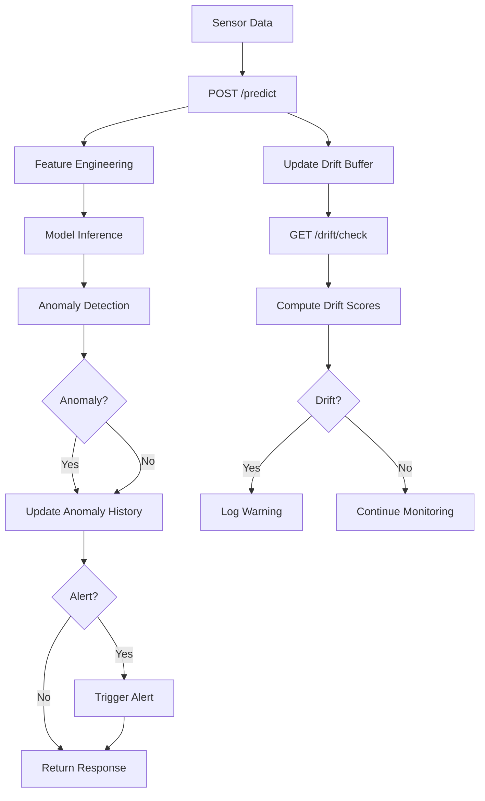
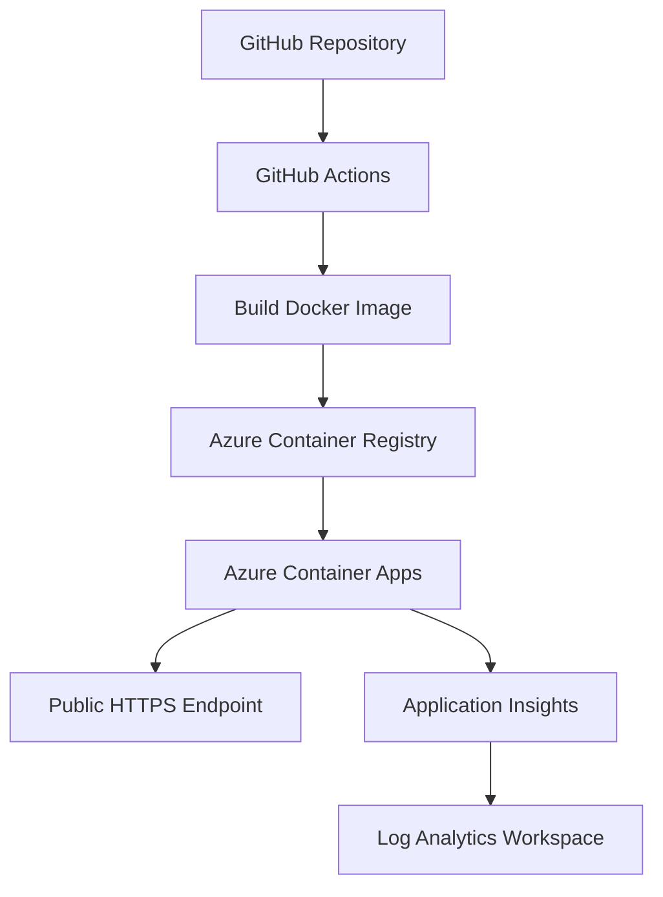
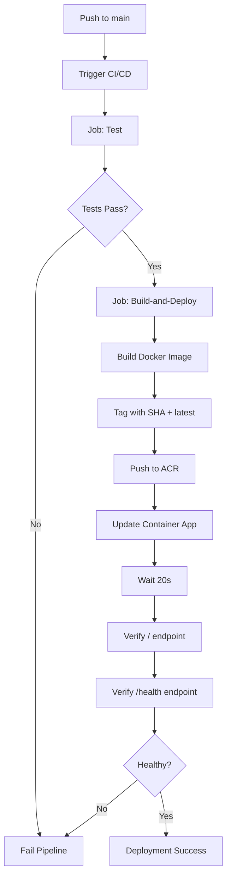

# EV Energy MLOps Pipeline

[](https://www.python.org/) [](https://fastapi.tiangolo.com/) [](https://scikit-learn.org/) [](https://mlflow.org/) [](https://www.docker.com/) [](https://azure.microsoft.com/) [](https://streamlit.io/)

**Production-Grade Machine Learning System for Electric Vehicle Energy Anomaly Detection**

🚀 **Live API**: [EV Energy MLOps API](https://app-ev-energy-api.politetree-fd6ee87e.norwayeast.azurecontainerapps.io/)

---

## Table of Contents
- [Project Overview](#project-overview)
- [Use Case](#use-case)
- [Machine Learning Approach](#machine-learning-approach)
- [Dataset](#dataset)
- [Architecture](#architecture)
- [Training Pipeline](#training-pipeline)
- [API Documentation](#api-documentation)
- [Containerization](#containerization)
- [Deployment on Azure](#deployment-on-azure)
- [CI/CD Pipeline](#cicd-pipeline)
- [Monitoring and Maintenance](#monitoring-and-maintenance)
- [Simulator Commands](#simulator-commands)
- [KQL Queries](#kql-queries)
- [Streamlit Application - Frontend Interface](#streamlit-application---frontend-interface)
- [Conclusion](#conclusion)

---

## Project Overview

This project implements a complete end-to-end MLOps pipeline for detecting abnormal energy consumption in electric vehicles using a context-aware machine learning model. The system simulates an AIoT 4.0 environment where:

- EV sensor data is streamed in real-time
- A regression model predicts expected energy consumption
- Anomalies are detected when actual consumption significantly exceeds predictions
- Persistent anomalies trigger alerts
- Data drift is continuously monitored
- Operational metrics are logged to Azure Application Insights

The solution follows production-grade MLOps best practices including reproducible training, experiment tracking with MLflow, automated CI/CD, containerization, cloud deployment, and comprehensive monitoring.

---

## Use Case

**Problem Statement:** If an electric vehicle consumes significantly more energy than expected for a given driving context (speed, slope, battery state, weather, etc.), the system should alert the driver of a potential issue such as inefficient driving behavior, battery degradation, or vehicle malfunction.

**Business Value:** Early detection of anomalies enables predictive maintenance, reduces operational costs, improves fleet efficiency, and enhances driver safety.

---

## Machine Learning Approach

### Why Regression Instead of Classification?

High energy consumption is not always anomalous. Factors such as high speed, steep inclines, sport driving mode, or adverse weather conditions naturally increase energy usage. Therefore:

- We model **expected energy consumption** using regression
- **Anomaly = actual consumption significantly exceeding predicted consumption**
- This approach captures context-aware deviations rather than absolute thresholds

### Algorithm

**HistGradientBoostingRegressor** (sklearn):
- Fast training on medium-sized datasets
- Handles mixed features (numeric and categorical)
- Robust performance without extensive hyperparameter tuning
- Native support for categorical encoding

---

## Dataset

**Source:** [EV Energy Consumption Dataset](https://www.kaggle.com/datasets/ziya07/ev-energy-consumption-dataset)

### Selected Features

| Feature | Type | Description |
|---------|------|-------------|
| Speed_kmh | Numeric | Vehicle speed (km/h) |
| Acceleration_ms2 | Numeric | Acceleration (m/s²) |
| Slope_% | Numeric | Road slope (%) |
| Temperature_C | Numeric | Outside temperature (°C) |
| Battery_State_% | Numeric | Battery state of charge (%) |
| Driving_Mode | Categorical | Eco / Normal / Sport |
| Traffic_Condition | Categorical | Low / Medium / High |
| Energy_Consumption_kWh | Target | Actual energy consumption (kWh) |

---

## Architecture

```
ev-energy-mlops-pipeline/
├── .github/
│   └── workflows/
│       └── cicd.yml           # GitHub Actions CI/CD
├── app/
│   ├── main.py                # FastAPI application
│   ├── models.py              # Pydantic models
│   ├── utils.py               # Model loading and inference
│   └── drift_detect.py        # Drift detection logic
├── training/
│   ├── 01_preprocess.py       # Data preprocessing
│   ├── 02_train.py            # Model training
│   └── 03_eval.py             # Model evaluation and config generation
├── simulator/
│   ├── ev_sensor_simulator.py # Real-time data simulator
│   └── scenarios.py           # Normal, anomaly, drift scenarios
├── model/
│   ├── ev_energy_model.pkl    # Trained model artifact
│   ├── feature_config.json    # Feature metadata
│   ├── anomaly_config.json    # Anomaly detection thresholds
│   └── baseline_stats.json    # Baseline statistics for drift detection
├── data/
│   ├── raw/                   # Raw dataset
│   └── processed/             # Processed dataset
├── mlruns/                    # MLflow experiment tracking
├── tests/                     # Unit and integration tests
├── Dockerfile                 # Container image definition
├── requirements.txt           # Python dependencies
└── README.md                  # This file
```

---

## Training Pipeline

The ML pipeline consists of three sequential steps executed locally with MLflow tracking.

### Step 1: Data Preprocessing

**Script:** `training/01_preprocess.py`

**Operations:**
- Load raw dataset from `data/raw/EV_Energy_Consumption_Dataset.csv`
- Select relevant features (5 numeric + 2 categorical)
- Parse and validate timestamps
- Handle missing values:
  - Numeric features: fill with median
  - Categorical features: fill with mode
- Clean categorical strings (strip, lowercase)
- Drop rows with missing target values
- Save processed dataset to `data/processed/ev_energy_processed.csv`

**Execution:**
```bash
python training/01_preprocess.py
```

### Step 2: Model Training

**Script:** `training/02_train.py`

**Operations:**
- Load processed dataset
- Split data (80% train, 20% test, stratified by quantile of target)
- Build sklearn pipeline:
  - Numeric features: StandardScaler
  - Categorical features: OneHotEncoder (handle_unknown='ignore')
  - Model: HistGradientBoostingRegressor
- Train model on training set
- Evaluate on test set (MAE, RMSE, R²)
- Log metrics, parameters, and artifacts to MLflow
- Save trained pipeline to `model/ev_energy_model.pkl`
- Save feature configuration to `model/feature_config.json`
- Register model in MLflow Model Registry

**Execution:**
```bash
python training/02_train.py
```

**MLflow Tracking:**
- Experiment name: `ev-energy-consumption`
- Logged metrics: `mae`, `rmse`, `r2`
- Logged parameters: `max_iter`, `max_depth`, `learning_rate`, `random_state`
- Logged artifacts: model, feature config, prediction plot

### Step 3: Evaluation and Configuration

**Script:** `training/03_eval.py`

**Operations:**
- Load trained model and processed dataset
- Generate predictions on full dataset
- Compute residuals (actual - predicted)
- Compute error percentages
- Calculate anomaly detection thresholds:
  - 95th percentile of positive residuals
  - 95th percentile of positive error percentages
- Generate anomaly detection configuration:
  - Threshold values
  - Alerting rules (window size, consecutive anomalies)
- Compute baseline statistics for drift detection:
  - Mean, std, min, max, percentiles (p25, p50, p75, p95)
  - For all numeric features and target
- Save configurations:
  - `model/anomaly_config.json`
  - `model/baseline_stats.json`
- Log thresholds and baseline stats to MLflow

**Execution:**
```bash
python training/03_eval.py
```

**Output Artifacts:**
- `anomaly_config.json`: Thresholds and alerting parameters
- `baseline_stats.json`: Reference statistics for drift monitoring

### Complete Training Workflow



---

## API Documentation

The API is built with FastAPI and provides endpoints for real-time inference, batch predictions, drift detection, and maintenance.

### Base URL
- **Production:** `https://app-ev-energy-api.politetree-fd6ee87e.norwayeast.azurecontainerapps.io`
- **Local:** `http://127.0.0.1:8000`

### Endpoints

#### 1. Root Endpoint

**GET /** 

Returns API status message.

**Response:**
```json
{
  "message": "EV Energy MLOps Pipeline API is running."
}
```

#### 2. Health Check

**GET /health**

Returns API health status and model loading state.

**Response:**
```json
{
  "status": "ok",
  "model_loaded": true,
  "model_path": "model/ev_energy_model.pkl"
}
```

**Use Case:** Liveness and readiness probes for container orchestration.

#### 3. Single Prediction

**POST /predict**

Predicts energy consumption for a single sensor reading and detects anomalies.

**Request Body:**
```json
{
  "vehicle_id": "vehicle_001",
  "Speed_kmh": 80.5,
  "Acceleration_ms2": 0.5,
  "Slope_%": 2.0,
  "Temperature_C": 15.0,
  "Battery_State_%": 75.0,
  "Driving_Mode": "normal",
  "Traffic_Condition": "medium",
  "Energy_Consumption_kWh": 12.5
}
```

**Response:**
```json
{
  "vehicle_id": "vehicle_001",
  "predicted_kwh": 11.2,
  "actual_kwh": 12.5,
  "residual_kwh": 1.3,
  "error_pct": 11.6,
  "is_anomaly": false,
  "alert": false,
  "thresholds": {
    "residual_threshold_kwh_p95": 2.5,
    "error_pct_threshold_p95": 25.0
  }
}
```

**Behavior:**
- Computes prediction using trained model
- If `Energy_Consumption_kWh` is provided, computes residual and checks for anomaly
- Maintains sliding window of recent anomalies per vehicle
- Triggers alert if consecutive or frequent anomalies detected
- Logs prediction event to Application Insights
- Updates drift detection buffer

#### 4. Batch Prediction

**POST /predict/batch**

Processes multiple predictions in a single request.

**Request Body:**
```json
{
  "items": [
    {
      "vehicle_id": "vehicle_001",
      "Speed_kmh": 80.5,
      ...
    },
    {
      "vehicle_id": "vehicle_002",
      "Speed_kmh": 60.0,
      ...
    }
  ]
}
```

**Response:**
```json
{
  "results": [
    {
      "vehicle_id": "vehicle_001",
      "predicted_kwh": 11.2,
      ...
    },
    {
      "vehicle_id": "vehicle_002",
      "predicted_kwh": 8.5,
      ...
    }
  ]
}
```

#### 5. Drift Check

**GET /drift/check**

Analyzes recent data stream for distribution drift relative to training baseline.

**Response:**
```json
{
  "drift_detected": false,
  "drift_score": 0.8,
  "feature_scores": {
    "Speed_kmh": 0.5,
    "Acceleration_ms2": 1.2,
    "Slope_%": 0.3,
    "Temperature_C": 0.7,
    "Battery_State_%": 0.9
  },
  "message": "No drift (max_z=1.20, avg_z=0.72)."
}
```

**Logic:**
- Compares recent buffer (last 200 points) to baseline statistics
- Computes Z-scores: `|(mean_recent - mean_baseline) / std_baseline|`
- Drift detected if any feature Z-score > 2.0
- Logs drift check event to Application Insights

**Use Case:** Monitoring data distribution changes that may degrade model performance.

#### 6. Stream Reset

**POST /stream/reset?vehicle_id=vehicle_001**

Resets anomaly history and drift buffer for maintenance or after scenario testing.

**Response:**
```json
{
  "status": "ok",
  "message": "State reset for vehicle_001 (drift buffer + anomaly history)."
}
```

**Use Case:** Clear state after running simulator scenarios or during maintenance windows.

### API Workflow



---

## Containerization

The application is containerized using Docker for consistent deployment across environments.

### Dockerfile

**Base Image:** `python:3.11-slim`

**Key Features:**
- Multi-stage optimization for reduced image size
- System dependencies for scientific computing (build-essential)
- Python environment isolation
- Optimized layer caching
- Health check support

**Build Command:**
```bash
docker build -t ev-energy-api:latest .
```

**Run Locally:**
```bash
docker run -d -p 8000:8000 \
  --name ev-energy-api \
  ev-energy-api:latest
```

**Test Locally:**
```bash
curl http://localhost:8000/health
```

**Image Layers:**
1. Base Python 3.11 runtime
2. System dependencies installation
3. Python dependencies from requirements.txt
4. Application code copy
5. Entrypoint configuration (uvicorn)

---

## Deployment on Azure

The application is deployed on **Azure Container Apps**, a fully managed serverless container platform.

### Infrastructure Components

- **Resource Group:** `rg-ev-energy-mlops`
- **Container Registry:** `acrevenergyabdou14885.azurecr.io`
- **Container App:** `app-ev-energy-api`
- **Region:** Norway East
- **Application Insights:** Configured for monitoring

### Deployment Architecture



### Configuration

**Environment Variables:**
- `APPLICATIONINSIGHTS_CONNECTION_STRING`: Application Insights connection for logging

**Ingress:**
- External ingress enabled
- Target port: 8000
- HTTPS enabled with automatic certificate

**Scaling:**
- Min replicas: 1
- Max replicas: 3
- Scale rule: HTTP request concurrency

### Manual Deployment

If deploying manually (not via CI/CD):

```bash
# Login to Azure
az login

# Build and push image
az acr build --registry acrevenergyabdou14885 \
  --image ev-energy-api:latest .

# Update container app
az containerapp update \
  --name app-ev-energy-api \
  --resource-group rg-ev-energy-mlops \
  --image acrevenergyabdou14885.azurecr.io/ev-energy-api:latest
```

---

## CI/CD Pipeline

Continuous Integration and Continuous Deployment are automated using GitHub Actions.

### Workflow File

**Location:** `.github/workflows/cicd.yml`

### Trigger

- **Push to main branch:** Automatic deployment
- **Pull requests:** Run tests only
- **Manual trigger:** `workflow_dispatch`

### Jobs

#### Job 1: Test

**Purpose:** Validate code quality and functionality before deployment.

**Steps:**
1. Checkout repository
2. Set up Python 3.11
3. Install dependencies from requirements.txt
4. Install pytest and pytest-cov
5. Run tests with coverage:
   ```bash
   pytest tests/ -v --cov=app --cov-report=term
   ```

**Conditions:** Runs on all triggers (push, PR, manual).

#### Job 2: Build and Deploy

**Purpose:** Build Docker image, push to ACR, and deploy to Azure Container Apps.

**Dependencies:** Requires `test` job to pass.

**Conditions:** Only runs on push to main branch.

**Steps:**

1. **Checkout code**
   ```yaml
   uses: actions/checkout@v4
   ```

2. **Azure Login**
   ```yaml
   uses: azure/login@v1
   with:
     creds: ${{ secrets.AZURE_CREDENTIALS }}
   ```

3. **Login to ACR**
   ```yaml
   uses: azure/docker-login@v1
   with:
     login-server: acrevenergyabdou14885.azurecr.io
     username: ${{ secrets.ACR_USERNAME }}
     password: ${{ secrets.ACR_PASSWORD }}
   ```

4. **Build and Push Docker Image**
   - Build image with commit SHA tag
   - Tag as latest
   - Push both tags to ACR
   ```bash
   docker build -t acrevenergyabdou14885.azurecr.io/ev-energy-api:$GITHUB_SHA .
   docker tag acrevenergyabdou14885.azurecr.io/ev-energy-api:$GITHUB_SHA \
              acrevenergyabdou14885.azurecr.io/ev-energy-api:latest
   docker push acrevenergyabdou14885.azurecr.io/ev-energy-api:$GITHUB_SHA
   docker push acrevenergyabdou14885.azurecr.io/ev-energy-api:latest
   ```

5. **Deploy to Azure Container Apps**
   ```bash
   az containerapp update \
     --name app-ev-energy-api \
     --resource-group rg-ev-energy-mlops \
     --image acrevenergyabdou14885.azurecr.io/ev-energy-api:$GITHUB_SHA
   ```

6. **Verify Deployment**
   - Retrieve container app FQDN
   - Wait 20 seconds for startup
   - Test `/` endpoint
   - Test `/health` endpoint
   - Exit with error if either test fails
   ```bash
   APP_FQDN=$(az containerapp show --name app-ev-energy-api \
     --resource-group rg-ev-energy-mlops \
     --query properties.configuration.ingress.fqdn -o tsv)
   curl -f https://$APP_FQDN/ || exit 1
   curl -f https://$APP_FQDN/health || exit 1
   ```

### Workflow Diagram



### Secrets Required

The following secrets must be configured in GitHub repository settings:

- `AZURE_CREDENTIALS`: Service principal JSON for Azure authentication
- `ACR_USERNAME`: Azure Container Registry username
- `ACR_PASSWORD`: Azure Container Registry password

---

## Monitoring and Maintenance

### Objective

Ensure production visibility, detect drift and anomalies, and maintain operational health.

### Monitoring Stack

**Azure Application Insights:**
- Integrated with Log Analytics Workspace
- Structured logging from FastAPI application
- Real-time metrics and alerting capabilities
- Custom dimensions for ML-specific events

### Logged Events

#### 1. Prediction Events

**Event Type:** `prediction`

**Logged Fields:**
- `vehicle_id`: Vehicle identifier
- `predicted_kwh`: Model prediction
- `actual_kwh`: Actual consumption (if available)
- `residual_kwh`: Prediction error
- `error_pct`: Percentage error
- `is_anomaly`: Anomaly flag
- `alert`: Alert flag

**Use Case:** Track prediction volume, error distribution, anomaly frequency.

#### 2. Drift Check Events

**Event Type:** `drift_check`

**Logged Fields:**
- `drift_detected`: Boolean flag
- `drift_score`: Average Z-score across features
- `max_z`: Maximum Z-score among features
- `buffer_size`: Number of recent points analyzed

**Use Case:** Monitor data distribution changes over time.

#### 3. Stream Reset Events

**Event Type:** `stream_reset`

**Logged Fields:**
- `vehicle_id`: Vehicle identifier

**Use Case:** Track maintenance operations and scenario resets.

### Maintenance Operations

The system supports operational maintenance through the simulator and API endpoints.

**Scenarios:**

1. **Normal Streaming:** Baseline operation
2. **Anomaly Injection:** Test anomaly detection logic
3. **Drift Simulation:** Test drift detection and recovery
4. **State Reset:** Clear buffers after testing

**Workflow:**
- Run simulator scenario (normal/anomaly/drift)
- Monitor logs in Application Insights
- Verify expected behavior (anomalies detected, alerts triggered, drift flagged)
- Execute reset endpoint
- Verify state cleared
- Resume normal operation

### Operational Status

**Status:** Fully operational and validated

**Validated Features:**
- Application Insights integration
- Structured logging with custom dimensions
- Prediction logging
- Drift detection and logging
- Anomaly detection and alerting
- Simulator scenarios (normal, anomaly, drift)
- State reset functionality
- KQL query execution
- Drift detection and recovery after reset

---

## Simulator Commands

The simulator generates realistic EV sensor data streams for testing and demonstration.

**Script:** `simulator/ev_sensor_simulator.py`

### Environment Setup

```bash
# Set production API URL
export APP_URL="https://app-ev-energy-api.politetree-fd6ee87e.norwayeast.azurecontainerapps.io"
export PREDICT_URL="$APP_URL/predict"

# Or for local testing
export PREDICT_URL="http://127.0.0.1:8000/predict"
```

### Scenario A: Normal Streaming

Simulates normal driving conditions with expected energy consumption.

```bash
python -m simulator.ev_sensor_simulator \
  --url "$PREDICT_URL" \
  --mode normal \
  --seconds 10
```

**Expected Behavior:**
- Predictions within normal range
- No anomalies detected
- No alerts triggered

### Scenario B: Anomaly Injection

Simulates abnormal energy consumption events.

```bash
python -m simulator.ev_sensor_simulator \
  --url "$PREDICT_URL" \
  --mode anomaly \
  --seconds 10
```

**Expected Behavior:**
- High residuals (actual > predicted)
- Anomalies detected (`is_anomaly: true`)
- Alerts triggered after consecutive anomalies

### Scenario C: Drift Simulation

Simulates gradual distribution shift in sensor data.

```bash
python -m simulator.ev_sensor_simulator \
  --url "$PREDICT_URL" \
  --mode drift \
  --seconds 20
```

**Expected Behavior:**
- Gradual increase in feature values
- Drift scores increase over time
- Drift detected after threshold exceeded

### Scenario D: Extended Drift

Forces drift detection by running longer simulation.

```bash
python -m simulator.ev_sensor_simulator \
  --url "$PREDICT_URL" \
  --mode drift \
  --seconds 30
```

### Drift Check

```bash
curl -s -X GET "$APP_URL/drift/check" | jq
```

### State Reset

After each scenario, reset the system state:

```bash
curl -s -X POST "$APP_URL/stream/reset" | jq
```

---

## KQL Queries

Execute these queries in **Application Insights → Logs**. Set time range to **Last 30 minutes**.

### Query 1: View All Recent Logs

```kql
traces
| where timestamp > ago(30m)
| order by timestamp desc
| project timestamp, message, customDimensions
| take 50
```

### Query 2: Prediction Events

```kql
traces
| where message == "prediction"
| order by timestamp desc
| project timestamp, customDimensions
| take 50
```

### Query 3: Prediction Volume (Per Minute)

```kql
traces
| where message == "prediction"
| summarize predictions=count() by bin(timestamp, 1m)
| order by timestamp desc
```

### Query 4: Anomalies Detected

```kql
traces
| where message == "prediction"
| extend is_anomaly = tostring(customDimensions.is_anomaly)
| where is_anomaly == "True"
| order by timestamp desc
| project timestamp, customDimensions
| take 50
```

### Query 5: Alerts Triggered

```kql
traces
| where message == "prediction"
| extend alert = tostring(customDimensions.alert)
| where alert == "True"
| order by timestamp desc
| project timestamp, customDimensions
| take 50
```

### Query 6: Drift Check Events

```kql
traces
| where message == "drift_check"
| order by timestamp desc
| project timestamp, customDimensions
| take 50
```

### Query 7: Drift Detected

```kql
traces
| where message == "drift_check"
| extend drift = tostring(customDimensions.drift_detected)
| where drift == "True"
| order by timestamp desc
| project timestamp, customDimensions
| take 50
```

### Query 8: Stream Reset Events

```kql
traces
| where message == "stream_reset"
| order by timestamp desc
| project timestamp, customDimensions
| take 50
```

### Query 9: Errors

```kql
traces
| where severityLevel >= 3
| order by timestamp desc
| project timestamp, severityLevel, message, customDimensions
| take 50
```

### Query 10: Anomaly Rate Over Time

```kql
traces
| where message == "prediction"
| extend is_anomaly = tostring(customDimensions.is_anomaly)
| summarize 
    total=count(), 
    anomalies=countif(is_anomaly == "True"),
    anomaly_rate=100.0 * countif(is_anomaly == "True") / count()
  by bin(timestamp, 5m)
| order by timestamp desc
```

---

## Streamlit Application - Frontend Interface

A complete Streamlit application for real-time monitoring and analysis of electric vehicle energy consumption.

### Features

#### Authentication
- User registration (Sign up) with MySQL database (db4free.net)
- Secure login with SHA-256 password hashing
- Session management

#### Manual Prediction
- Interactive form for vehicle parameters
- Instant energy consumption prediction
- Real-time anomaly detection
- Graphical visualizations with threshold comparison

#### Real-Time Streaming
- EV connection simulation
- 3 streaming modes:
  - **Normal**: Standard driving conditions
  - **Anomaly**: Inject anomalies for testing
  - **Drift**: Simulate data drift
- Real-time data visualization with live charts
- Visual alerts for anomaly detection
- Session statistics and final analysis

#### Analytics Dashboard
- Real-time KPIs
- Drift detection with per-feature analysis
- Historical data analysis
- CSV data export
- API health monitoring

### Prerequisites

#### Database Setup (db4free.net)

1. Create an account on [db4free.net](https://www.db4free.net/)
2. Create a new MySQL database
3. Note your credentials:
   - Host: `db4free.net`
   - Port: `3306`
   - Username: your username
   - Password: your password
   - Database: your database name

#### Configuration with .env

1. **Navigate to streamlit app directory**:
   ```bash
   cd streamlit_app
   ```

2. **Copy the example file**:
   ```bash
   cp .env.example .env
   ```

3. **Edit the .env file** with your actual values:
   ```bash
   nano .env  # or vim, or your preferred editor
   ```

4. **Fill in the variables** (ALL REQUIRED):
   ```env
   # Database Configuration (db4free.net) - REQUIRED
   DB_HOST=db4free.net
   DB_PORT=3306
   DB_USER=your_username
   DB_PASSWORD=your_password
   DB_NAME=your_database
   
   # API Configuration - REQUIRED
   API_BASE_URL=https://app-ev-energy-api.politetree-fd6ee87e.norwayeast.azurecontainerapps.io
   ```


### Installation

#### 1. Create a virtual environment

```bash
cd streamlit_app
python -m venv venv
```

#### 2. Activate the environment

**Linux/Mac:**
```bash
source venv/bin/activate
```

**Windows:**
```bash
venv\Scripts\activate
```

#### 3. Install dependencies

```bash
pip install -r requirements.txt
```

### Running the Application

#### Start the application

```bash
streamlit run app.py
```

The application will be accessible at: `http://localhost:8501`

### Usage Guide

#### 1. First Connection

1. **Sign Up**:
   - Go to the "Sign Up" tab
   - Fill in the form (username, email, full name, password)
   - Click "Sign Up"

2. **Login**:
   - Use your credentials to log in
   - Access the main dashboard

#### 2. Manual Prediction

1. Go to "Manual Prediction"
2. Enter vehicle parameters:
   - Speed (km/h)
   - Acceleration (m/s²)
   - Slope (%)
   - Temperature (°C)
   - Battery State (%)
   - Driving Mode (eco/normal/sport)
   - Traffic Condition (low/medium/high)
   - (Optional) Actual energy consumption
3. Use Quick Presets for common scenarios:
   - City Driving
   - Highway
   - Mountain
   - Bad Weather
4. Click "Predict"
5. View results and anomaly detection

#### 3. Real-Time Streaming

1. Go to "Real-Time Streaming"
2. Configure streaming:
   - Enter Vehicle ID
   - Select a mode (Normal / Anomaly / Drift)
   - Set duration (10-120 seconds)
   - Set update rate (1-5 seconds)
3. Click "Start Streaming"
4. Observe real-time visualizations:
   - Energy consumption time series
   - Latest prediction comparison
   - Anomaly detection markers
   - Error percentage trends
5. Watch for alerts:
   - Red = Anomaly detected
   - Animation = Multiple anomalies

**IMPORTANT**: Always **Reset Stream** before launching a new scenario!

#### 4. Analytics Dashboard

1. Go to "Dashboard"
2. View global KPIs
3. Check for drift with "Check for Data Drift"
4. Analyze charts:
   - Consumption trends
   - Error distribution
   - Anomaly timeline
5. Export data to CSV if needed

### User Interface

#### Design
- Modern interface with purple/blue gradient
- Smooth animations and visual effects
- Responsive design
- Colored cards and metrics

#### Alerts
- **Anomalies**: Red pulse animation
- **Multiple alerts**: Visual indicators
- **Drift**: Orange badge with severity level

### Application Structure

```
streamlit_app/
├── app.py                          # Main page (Login/Home)
├── pages/
│   ├── 2_Manual_Prediction.py      # Manual predictions
│   ├── 3_Real_Time_Streaming.py    # Real-time streaming
│   └── 4_Dashboard.py              # Analytics dashboard
├── utils/
│   ├── __init__.py
│   ├── auth.py                     # Authentication utilities
│   ├── database.py                 # Database management
│   └── api_client.py               # API client
├── .streamlit/
│   └── config.toml                 # Streamlit configuration
├── config.py                       # Application configuration
├── requirements.txt                # Python dependencies
├── .env.example                    # Environment variables template
├── .env                            # Your actual config (DO NOT COMMIT)
└── .gitignore                      # Git ignore rules
```

### Security

- Passwords hashed with SHA-256
- Secure sessions
- No hardcoded credentials in code
- All sensitive data from .env file only
- Environment variables required in production

---

## Conclusion

This project demonstrates a complete, production-grade MLOps pipeline for an industrial use case. The system integrates machine learning, software engineering, cloud infrastructure, and operational monitoring to deliver a reliable and scalable anomaly detection service for electric vehicles.

Key achievements:
- End-to-end ML pipeline with reproducibility
- Real-world use case with practical business value
- Production deployment on Azure with automated CI/CD
- Operational monitoring with Application Insights
- Comprehensive testing and validation framework

**Technologies Used:** Python, scikit-learn, MLflow, FastAPI, Docker, Azure Container Apps, Azure Container Registry, GitHub Actions, Application Insights, KQL
