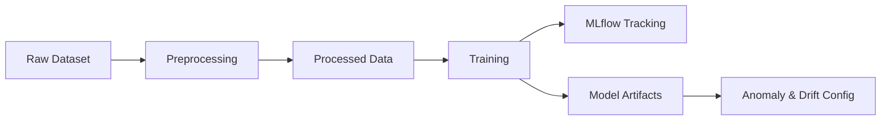
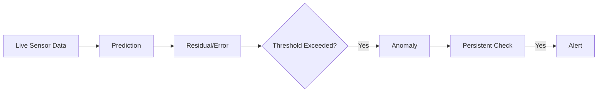

# 🚗 EV Energy MLOps Pipeline  
### AIoT 4.0 – Real-Time Electric Vehicle Energy Anomaly Detection

---

## 📌 Project Overview

This project implements a **complete MLOps pipeline** for detecting **abnormal energy consumption in electric vehicles (EVs)** using a **context-aware machine learning model**.

The system is designed as an **AIoT 4.0 simulation**:
- EV sensor data is streamed in real time (simulated)
- A regression model predicts the expected energy consumption
- An anomaly is detected when actual consumption is significantly higher than expected
- Persistent anomalies trigger alerts
- Data drift is monitored over time

The solution follows **production-grade MLOps practices**:
- Reproducible training pipeline
- MLflow experiment tracking
- Model artifact management
- Drift detection
- Future CI/CD and cloud deployment (Azure)

---

## 🎯 Use Case

> *“If an electric vehicle consumes significantly more energy than expected for a given driving context (speed, slope, battery state, weather, etc.), the system alerts the driver of a potential issue (inefficient driving, battery degradation, or vehicle malfunction).”*

---

## 🧠 Machine Learning Approach

### Why Regression (not Classification)?

High energy consumption is **not always an anomaly**:
- High speed, steep slope, or sport mode are normal explanations

👉 Therefore, we model:
- **Expected energy consumption** using regression
- **Anomaly = large positive prediction error**

---

## 📊 Dataset

**EV Energy Consumption Dataset**

### Selected Features

| Feature | Description |
|------|------------|
| Speed_kmh | Vehicle speed (km/h) |
| Acceleration_ms2 | Acceleration (m/s²) |
| Slope_% | Road slope (%) |
| Temperature_C | Outside temperature (°C) |
| Battery_State_% | Battery state of charge (%) |
| Driving_Mode | Eco / Normal / Sport |
| Traffic_Condition | Low / Medium / High |
| Energy_Consumption_kWh | **Target – actual energy consumption** |

---

## 🏗️ Project Architecture

```
ev-energy-mlops-pipeline/
├── app/                # FastAPI inference & drift detection
├── training/           # ML pipeline
├── data/               # Raw / processed / drift data
├── model/              # Models & configs
├── simulator/          # Streaming simulation
├── tests/
├── mlruns/             # MLflow experiments
└── README.md
```

---

## 🔄 MLOps Pipeline Flow



---

## 🧪 Step 1 – Preprocessing

Script: `training/01_preprocess.py`

- Feature selection
- Missing value handling
- Data cleaning

Output:
```
data/processed/ev_energy_processed.csv
```

---

## 🤖 Step 2 – Model Training

Script: `training/02_train.py`

- Model: `RandomForestRegressor`
- Pipeline:
  - StandardScaler (numerical)
  - OneHotEncoder (categorical)
- MLflow tracking

### Metrics

| Metric | Value |
|-----|------|
| MAE | ~1.10 kWh |
| RMSE | ~1.33 kWh |
| R² | ~0.64 |

---

## 🚨 Step 3 – Anomaly & Drift Evaluation

Script: `training/03_eval.py`

### Anomaly Thresholds
- Residual > **1.72 kWh**
- Error % > **20.9%**

### Alert Logic
- Window size: 20
- ≥ 10 anomalies in window OR ≥ 5 consecutive anomalies



---

## 📉 Drift Detection

Baseline statistics stored from training:
- Mean, std
- Quantiles (p25, p50, p75, p95)

Used to compare live data distributions.

---

## 📦 Artifacts

| File | Purpose |
|---|---|
| ev_energy_model.pkl | Trained model |
| feature_config.json | Feature schema |
| anomaly_config.json | Anomaly rules |
| baseline_stats.json | Drift baseline |
| mlruns/ | MLflow logs |

---

## 🚀 Next Steps

- FastAPI service
- Streaming endpoint
- Dockerization
- CI/CD (GitHub Actions)
- Azure deployment
- Monitoring & alerts

---

## 🏁 Key Takeaway

A **production-style AIoT + MLOps prototype** demonstrating:
- Context-aware ML
- Real-time anomaly detection
- Experiment tracking
- Drift awareness
